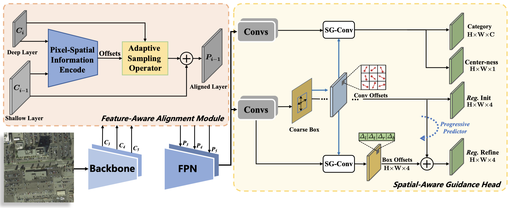

# FSANet: Feature-and-Spatial-Aligned Network for Tiny Object Detection in Remote Sensing Images

>   [FSANet: Feature-and-Spatial-Aligned Network for Tiny Object Detection in Remote Sensing Images](https://ieeexplore.ieee.org/document/9881582) \
>   *IEEE TGRS* 2022. \
>   [Jixiang Wu](http://lausen-ng.github.io/), [Zongxu Pan](http://people.ucas.ac.cn/~panzx), Bin Lei, Yuxin Hu.

## Abstract

Recently, many studies have successfully exploited Convolutional Neural Networks to improve the performance of object detection in remote sensing images. However, detecting tiny objects is still challenging for two main neglected problems: i) The features of tiny objects are insufficient and prone to aliasing during the multi-resolution aggregation process; ii) Tiny objects are position-sensitive, resulting in poor localization capabilities. In this article, we propose a Feature-and-Spatial Aligned Network (FSANet) to alleviate these issues. FSANet is an anchor-free detector that utilizes the alignment mechanism and progressive optimization strategy to obtain more discriminative features and accurate localization results. Concretely, we first present a Feature-Aware Alignment Module (FA<sup>2</sup>M) to align features with different resolutions during fusion. By learning transformation offsets, FA<sup>2</sup>M re-encodes pixel-spatial information between feature maps of adjacent levels and adaptively adjusts the regular feature interpolation. Additionally, a Spatial-Aware Guidance Head (SAGH) is introduced to iteratively optimize network predictions in a coarse-to-fine fashion. SAGH first predicts the object shape at each spatial location on feature maps. For more precise predictions, it then captures geometryaware convolutional features accordingly to update the coarse localization estimations. Extensive experiments are conducted on three tiny object detection datasets, i.e., AI-TOD, GF1-LRSD, and TinyPerson, demonstrating the effectiveness of our approach.

<div align="center">
	
</div>

## Updates

-   2022-09，the code is released.

## Usage

The code is bulit on [MMDetection v2.18.0](https://github.com/open-mmlab/mmdetection/releases/tag/v2.18.0) and [MMCV v1.3.16](https://github.com/open-mmlab/mmcv/releases/tag/v1.3.16), other versions may not be compatible well. Please refer to [Installation of MMDetection](https://mmdetection.readthedocs.io/en/v2.18.1/get_started.html#installation) and other tutorials for basic usages.

#### Train & Inference

```bash
python tools/train.py [CONFIG_FILE]

python tools/test.py [CONFIG_FILE] [CHECKPOINT_FILE] --eval bbox
```

## Citation

If you find this repository/work helpful in your research, welcome to cite the paper.

```bibtex
@ARTICLE{wu2022fsanet,
	author={Wu, Jixiang and Pan, Zongxu and Lei, Bin and Hu, Yuxin},  
	title={FSANet: Feature-and-Spatial-Aligned Network for Tiny Object Detection in Remote Sensing Images},   
	journal={IEEE Trans. Geosci. Remote Sens.},   
	year={2022},  
	volume={},  
	number={},  
	pages={1-1},  
	doi={10.1109/TGRS.2022.3205052}
}
```

